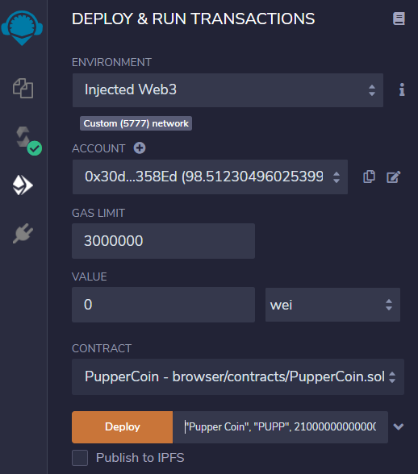
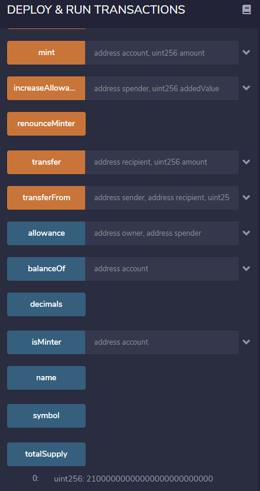

# PupperCoin Crowdsale

In this exercise, we are creating a new ERC20 token on the Ethereum network called "PupperCoin".  We will need to perform the following functions:
  * Create and deploy the token, with an initial supply.
  * Create and deploy all crowd sale functionality.
  * Create the auction, with begin and end dates.
  * Transfer a PupperCoin token to the correct wallet address, at the correct rate
  * Determine if and when the goal has been reached.

## Technology Needed

* The Solidity code is written in the Remix IDE located at www.remix.ethereum.org
* MyCrypto, Ganache, Metamask, and access to a test network (Ropsten or Kovan) will be needed to enable and test the transfer of tokens.
* Access to the OpenZeppelin framework (these will be imported from their github links in the same manner as a Content Distribution Network).
* OpenZeppelin has libraries that will be used for object inheritance when creating the token, and functionality for the crowd sale contract.

## The Process

The first thing that must be done is the creation of the token.  Without the token, there is nothing to sell.  This can be done by entering the following code into Remix:

When deploying, the initial supply must be entered as a parameter.  Remember to add 18 zeroes to the end of your desired initial supply!  Also note there will be a gas fee charged for the contract deployment.

Prior to deployment, ensure you have Ganache running for your local blockchain on your localhost, and select the options below - This will pop up MetaMask for you to confirm the transaction.

After this is completed, you can verify the initial supply, as well as see all of the additional functionality that was inherited.

Now that the coins have come to life, the next step is to get them into the marketplace via a crowdsale.  Below is the code needed to do so (the rest can be found in the repo):

This is compiled and deployed similar to the token itself.  Once again, a gas fee will be incurred.

Once again, you now have access to the crowd sale functionality on the left side of the IDE.

